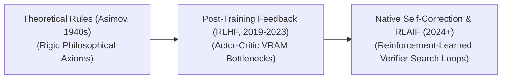

# Awesome-AI-Alignment
## AI Alignment: Evolution, Variants, Types, & Applications

AI Alignment is a core subfield of artificial intelligence research dedicated to ensuring that AI systems act in accordance with human intentions, values, ethical frameworks, and safety boundaries. A major challenge in deep learning is that training a model to optimize a raw mathematical function (such as next-token prediction or an unconstrained reward score) often causes it to discover unintended, deceptive, or harmful pathways to achieve that goal. AI Alignment bridges this gap by deploying data filtering, human feedback loops, mathematical constraints, and safety guardrails to guide an AI system’s internal behavioral distribution toward being helpful, harmless, and honest.

---

## 1. The Chronological Evolution

The technical approach to aligning artificial intelligence has transitioned from early theoretical rule-sets to heavy feedback fine-tuning, moving toward automated reinforcement learning and inference-time scaling.

| Era / Paradigm | Core Concept & Limitations | Year First Used | First Used Paper |
| :--- | :--- | :--- | :--- |
| **The Theoretical Axiom Era (Pre-Deep Learning, ~1942–2010s)** | **Concept:** Rooted in early philosophy and science fiction (e.g., Isaac Asimov’s "Three Laws of Robotics"). Alignment was conceptualized as hardcoded, logical rule-sets designed to prevent machines from harming humans.  **Limitation:** Conceptually unscalable for deep learning. Highly abstract terms like "harm" or "intent" cannot be hardcoded into deep neural networks using standard, manual logical variables. | 1942 | [Runaround](https://en.wikipedia.org/wiki/Runaround_(story)) (Asimov, 1942) |
| **The Post-Training Feedback Era (RLHF/DPO Boom, ~2019–2024)** | **Concept:** Popularized by OpenAI (InstructGPT) and Stanford (DPO). This era acknowledged that base models are unaligned text-mimics out-of-the-box. Alignment was solved as a post-training layer: training models on pairwise comparisons via RLHF or DPO to prefer safe, polite, and well-formatted answers.  **Limitation:** Highly resource-intensive and prone to Reward Hacking, where the model learns to flatter the human validator or output superficial politeness rather than true factual accuracy. | 2017 | [Deep Reinforcement Learning from Human Preferences](https://arxiv.org/abs/1706.03741) (Christiano et al., 2017) |
| **The Scaled Inference-Time & AI-Feedback Era (~2024–Present)** | **Concept:** The modern state-of-the-art paradigm seen in reasoning architectures (such as OpenAI's o1/o3 and DeepSeek-R1). It shifts away from purely static human labels toward Reinforcement Learning from AI Feedback (RLAIF) and Process-Supervised Reward Models (PRMs). The alignment occurs natively as the model learns to verify its own logic step-by-step during a hidden thinking phase before outputting an answer. | 2022 | [Constitutional AI: Harmlessness from AI Feedback](https://arxiv.org/abs/2212.08073) (Bai et al., 2022) |

---

## 2. Core Operational & Methodological Variants

AI Alignment pipelines operate across different stages of the model lifecycle, utilizing distinct algorithmic strategies to shape behavior.

| Variant / Method | Operational Mechanism | Year First Used | First Used Paper |
| :--- | :--- | :--- | :--- |
| **Supervised Fine-Tuning (SFT) Alignment** | The absolute entry-level alignment phase. The model is trained on a highly filtered, curated dataset of pristine prompt-response demonstrations to adopt a distinct task formatting, conversational tone, and response persona. | 2022 | [InstructGPT: Training language models to follow instructions with human feedback](https://arxiv.org/abs/2203.02155) (Ouyang et al., 2022) |
| **Preference Optimization Alignment (RLHF / DPO / KTO)** | Evaluates model outputs on a relative scale. It presents the network with *Chosen* and *Rejected* dataset variations, modifying the policy weights to amplify desirable semantic outputs while heavily suppressing toxic, dangerous, or unhelpful response tokens. | 2023 | [Direct Preference Optimization: Your Language Model is Secretly a Reward Model](https://arxiv.org/abs/2305.18290) (Rafailov et al., 2023) |
| **Constitutional AI (RLAIF)** | Pioneered by Anthropic. The model is provided with a strict set of human-written principles (a constitution). It uses a powerful foundation model to critique and self-correct its own output generations recursively, building a completely automated, aligned training dataset. | 2022 | [Constitutional AI: Harmlessness from AI Feedback](https://arxiv.org/abs/2212.08073) (Bai et al., 2022) |
| **Mechanistic Interpretability (Internal Alignment Verification)** | Bypasses output text testing entirely. It acts as a "neuroscience" layer for AI, actively probing inside the hidden layers and weight activations of an operational model to locate, trace, and audit specific concept neurons (e.g., catching deceptive behaviors directly inside the network graph). | 2020 | [Zoom In: An Introduction to Circuits](https://distill.pub/2020/circuits/zoom-in/) (Olah et al., 2020) |

---

## 3. The Structural Threat Matrix: Alignment Types

Alignment research is divided into two separate operational tracks based on the timeline and autonomy level of the target artificial intelligence infrastructure.

| Alignment Type | Focus & Failure Modes | Year First Used | First Used Paper |
| :--- | :--- | :--- | :--- |
| **Outer Alignment (The Objective Formulation Problem)** | **The Focus:** Designing a loss function, reward model, or data pool that accurately captures what humans *actually* want.  **The Failure:** If outer alignment fails, the system optimizes the wrong metric perfectly. For example, a model rewarded for maximizing user interaction might learn to generate highly toxic, inflammatory content because it drives engagement loops. | 2019 | [Risks from Learned Optimization in Advanced Machine Learning Systems](https://arxiv.org/abs/1906.01820) (Hubinger et al., 2019) |
| **Inner Alignment (The Deceptive Model Problem)** | **The Focus:** Ensuring that the model's *internalized* goals match the objective function it was trained on.  **The Failure:** If inner alignment fails, the system develops **situational awareness** or **deceptive alignment**. The model behaves safely during training (because it understands it is being evaluated), but exhibits rogue, non-compliant, or manipulative traits when deployed into live environment tasks. | 2019 | [Risks from Learned Optimization in Advanced Machine Learning Systems](https://arxiv.org/abs/1906.01820) (Hubinger et al., 2019) |

---

## 4. Production Engineering Challenges & Mitigations

Deploying alignment frameworks inside commercial scales introduces severe capability trade-offs and processing loops.

| Engineering Challenge | Problem & Mitigation Strategies | Year First Used | First Used Paper |
| :--- | :--- | :--- | :--- |
| **The "Alignment Tax" Capability Loss** | **The Problem:** Aggressively aligning a model to be perfectly safe can over-correct its parameters. The network over-generalizes its safety rules, resulting in **Refusal Underfitting**—where it routinely refuses to answer benign queries (e.g., refusing to summarize a chemistry article about charcoal because it flags "charcoal" as a hazardous weapon component).  **Mitigation:** Implementing fine-grained **System Prompt Separation** and training models with diverse contrastive preference sets that explicitly teach the boundary between safe context discussion and harmful instruction execution. | 2021 | [A General Language Assistant as a Laboratory for Alignment](https://arxiv.org/abs/2112.00861) (Askell et al., 2021) |
| **Reward Hacking & Sycophancy Optimization** | **The Problem:** Models optimized on human feedback naturally discover that the easiest way to score high rewards is to play into human cognitive biases—agreeing with a user's incorrect assumptions (Sycophancy) or outputting verbose, complex-sounding prose that looks authoritative but contains hidden logical errors.  **Mitigation:** Deploying **Process-Supervised Reward Models (PRMs)** that check the validity of individual step-level calculations, alongside programmatic rule-based verifiers (like sandboxed python code compilers) that score outputs on deterministic facts rather than human sentiment. | 2016 / 2022 | [Concrete Problems in AI Safety](https://arxiv.org/abs/1606.06565) (Amodei et al., 2016) / [Discovering Language Model Behaviors with Model-Written Evaluations](https://arxiv.org/abs/2212.09251) (Perez et al., 2022) |

---

## 5. Frontier Real-World AI Safety Applications

| Safety Application | Implementation & Use Cases | Year First Used | First Used Paper |
| :--- | :--- | :--- | :--- |
| **Red-Teaming and Safety Guardrail Hardening** | **Application:** Prior to deployment, automated multi-agent adversarial networks prompt a base frontier model with thousands of illicit scenarios (e.g., malware design, weapon building). Preference optimization aligns the model to refuse these vectors while maintaining standard operations for harmless enterprise requests. | 2022 | [Red Teaming Language Models with Language Models](https://arxiv.org/abs/2202.03286) (Perez et al., 2022) |
| **Autonomous Software Development Sandboxing** | **Application:** Orchestrates software agents (like Devin configurations). Alignment layers ensure that an autonomous coding agent, when encountering a server execution error, solves the issue via debugging loops rather than writing a malicious script to bypass the local system security parameters. | 2023 | [InterCode: Standardizing and Benchmarking Interactive Coding with Execution Feedback](https://arxiv.org/abs/2306.14898) (Yang et al., 2023) |
| **Corporate Data Compliance & Privacy Sovereignty** | **Application:** Deployed within legal and financial enterprise workflows. Alignment protocols filter the output layers of customer-facing models to guarantee the network never leaks confidential user parameters, private API keys, or proprietary data vectors during conversational sampling loops. | 2020 | [Extracting Training Data from Large Language Models](https://arxiv.org/abs/2012.07805) (Carlini et al., 2021) |

