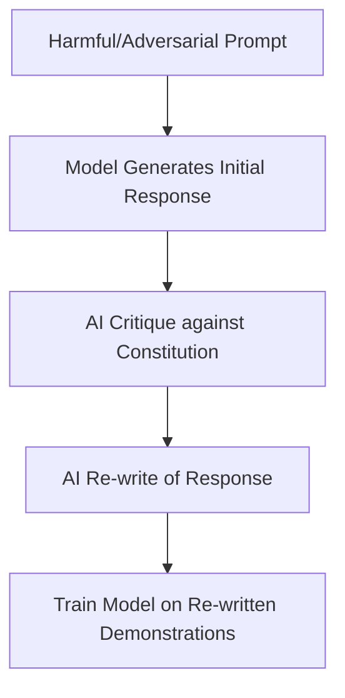

# Constitutional AI (RLAIF)

Constitutional AI is an alignment framework pioneered by Anthropic to train language models to be helpful, honest, and harmless without relying heavily on human feedback.

## The Two-Phase Process

### Phase 1: Supervised Learning (Self-Correction)
The model generates responses to toxic prompts, critiques its own responses against a set of written principles (the **Constitution**), and rewrites the responses to make them harmless.

### Phase 2: Reinforcement Learning (RLAIF)
A model is trained to choose between outputs using the constitution as a evaluator, replacing human feedback with automated AI feedback.

## Constitutional AI Flowchart

---
[← Back to README](../README.md)
