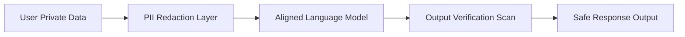

# Corporate Data Compliance & Privacy Sovereignty

Deploying frontier AI in legal, financial, and enterprise environments requires strict guarantees that models do not leak private user data, API keys, or proprietary codebase parameters.

## Privacy Techniques

- **Differential Privacy (DP):** Adding mathematical noise during training or retrieval to prevent the identification of specific data points.
- **Federated Learning:** Training models locally across multiple enterprise environments without sharing raw data.
- **Inference Filtering:** Real-time scanning of outputs to redact PII (Personally Identifiable Information) and API keys.

## Data Isolation Architecture

---
[← Back to README](../README.md)
