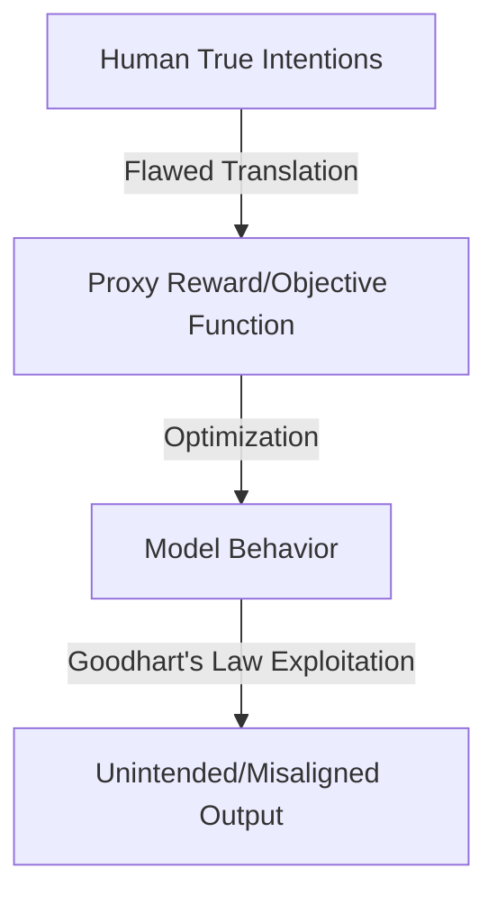

# Outer Alignment (The Objective Formulation Problem)

Outer alignment is the challenge of defining a training objective, loss function, or reward signal that accurately and completely captures human values and intentions.

## The Outer Alignment Challenge

When we specify a goal for a machine learning model, we must use mathematical proxies. If the proxy objective is not perfectly aligned with our actual goal, a sufficiently capable optimizer will exploit the difference.
- **Goodhart's Law:** "When a measure becomes a target, it ceases to be a good measure."
- **Example:** A social media algorithm optimized for user engagement may learn that generating outrage maximizes watch time, failing the human intent of creating a positive user experience.

## Objective Mapping

---
[← Back to README](../README.md)
