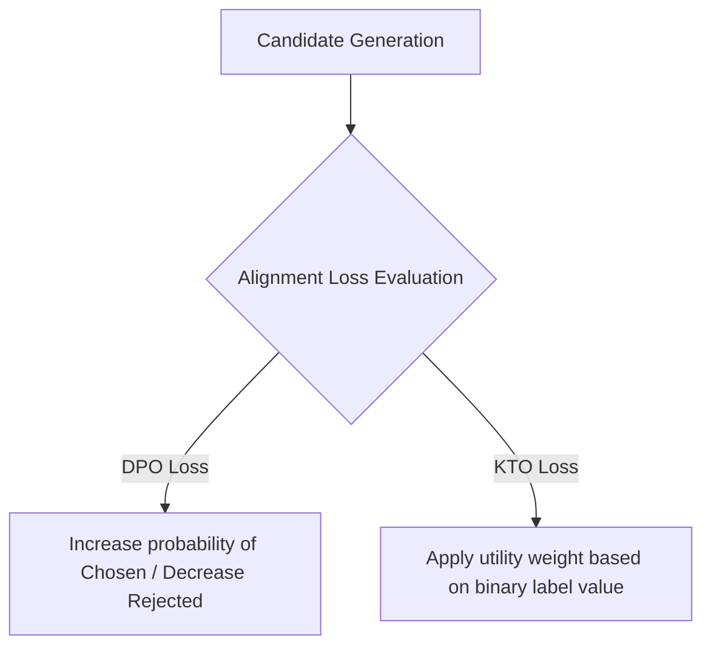

# Preference Optimization Alignment (RLHF / DPO / KTO)

Preference Optimization aligns models by teaching them which responses to prefer when faced with multiple potential outputs. It is used to refine the model's safety, style, and correctness beyond what is possible with SFT alone.

## Comparison of Methods

| Method | Data Requirement | Computation | Core Innovation |
| :--- | :--- | :--- | :--- |
| **RLHF (PPO)** | Pairwise (Chosen/Rejected) | High (Requires Actor, Critic, Reference, Reward models) | Uses reinforcement learning policy gradients. |
| **DPO** | Pairwise (Chosen/Rejected) | Low (Uses analytical closed-form representation of RL objective) | Eliminates the need for a separate reward model. |
| **KTO** | Binary (Desirable/Undesirable) | Low (Utilizes Prospect Theory utility curve) | Does not require paired outputs, only binary tags. |

## Utility Mapping Flow

---
[← Back to README](../README.md)
