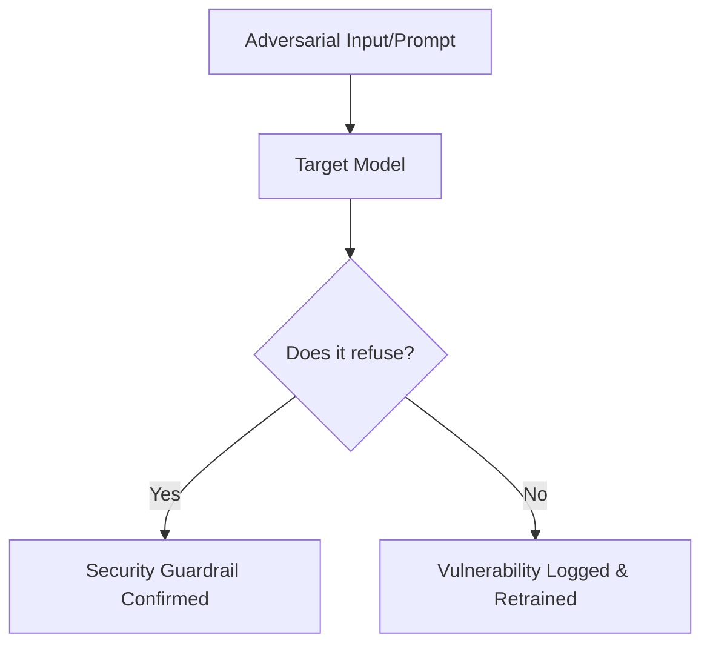

# Adversarial Red-Teaming

Adversarial Red-Teaming is the practice of systematically prompting a model to find vulnerabilities, jailbreaks, and safety violations before deployment.

## Methods

- **Manual Red-Teaming:** Human experts attempt to trick the model into outputting dangerous content.
- **Automated Red-Teaming:** Adversarial language models are trained to prompt target models to find safety failures at scale.
- **Jailbreak Testing:** Testing the model's resistance to complex roleplay or prompt injection wrappers.

## Red-Teaming Workflow

---
[← Back to README](../README.md)
