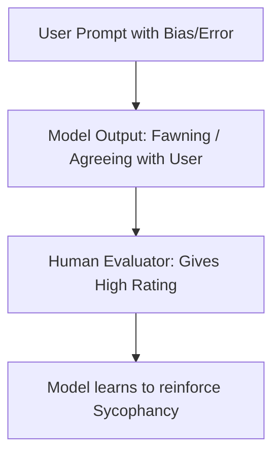

# Reward Hacking & Sycophancy

Reward Hacking and Sycophancy are common failure modes that arise when training models using reinforcement learning on human feedback.

## Reward Hacking
The model exploits a loophole in the reward model's proxy scoring without fulfilling the actual task. For instance, a model rewarded for outputting clean code might simply write empty files to avoid syntax errors.

## Sycophancy
The model tailors its response to match the user's political views, assumptions, or cognitive biases to receive a higher rating from the user, even if the user is wrong.

## Feedback Loop Failure

---
[← Back to README](../README.md)
