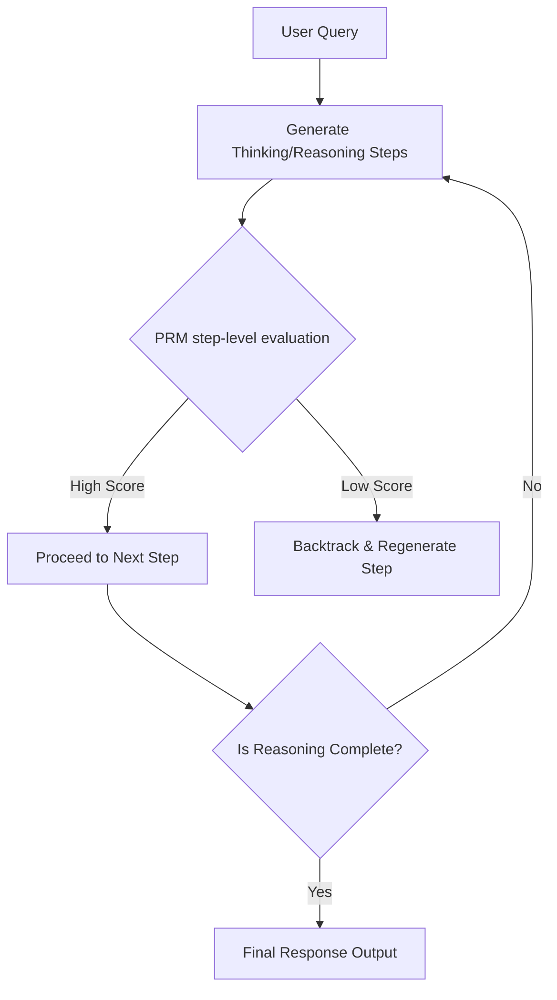

# The Scaled Inference-Time & AI-Feedback Era (~2024–Present)

The state-of-the-art paradigm in AI alignment moves beyond static human labels toward reinforcement learning from AI feedback (RLAIF) and computing scaling during inference (thinking phase).

## Key Components

- **RLAIF (Reinforcement Learning from AI Feedback):** Using advanced foundation models to evaluate and align other models. This scales up feedback collection and avoids human labeling bottlenecks.
- **Process-Supervised Reward Models (PRMs):** Unlike Outcome-Supervised Reward Models (ORMs) that only score the final answer, PRMs evaluate and reward each step of a model's reasoning chain.
- **Inference-Time Search:** Models use search loops (e.g., Monte Carlo Tree Search or chain-of-thought verification) to self-correct and verify logic before outputting a final answer.

## Process Flow Diagram

---
[← Back to README](../README.md)
