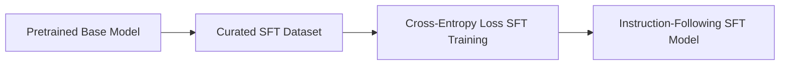

# Supervised Fine-Tuning (SFT) Alignment

Supervised Fine-Tuning (SFT) is the first and most critical stage of the post-training alignment pipeline. It bridges the gap between raw web-crawled pretraining data and a useful, instruction-following assistant.

## The SFT Process

1. **Data Curation:** High-quality prompt-response demonstrations are generated by human annotators or curated synthetically.
2. **Supervised Training:** The base model is trained on this dataset using standard cross-entropy loss, where loss is calculated only on the target response tokens.
3. **Behavioral Shift:** SFT aligns the model to adopt a helpful conversational persona, respond in structured formats (markdown, JSON), and follow explicit formatting instructions.

## SFT Pipeline Diagram

---
[← Back to README](../README.md)
