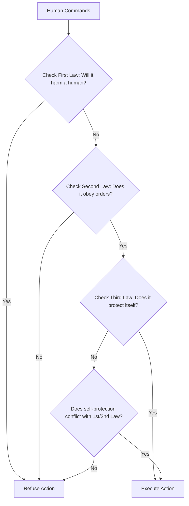

# The Theoretical Axiom Era (Pre-Deep Learning, ~1942–2010s)

The Theoretical Axiom Era represents the earliest phase of thinking about machine safety and alignment. Long before neural networks were capable of generating coherent text or images, scientists, philosophers, and science fiction writers conceptualized AI alignment as a problem of hardcoding rigid, logical rule-sets.

## Core Concepts

The most famous representation of this era is Isaac Asimov's **Three Laws of Robotics**, introduced in his 1942 short story *Runaround*:
1. **First Law:** A robot may not injure a human being or, through inaction, allow a human being to come to harm.
2. **Second Law:** A robot must obey the orders given it by human beings, except where such orders would conflict with the First Law.
3. **Third Law:** A robot must protect its own existence as long as such protection does not conflict with the First or Second Law.

In this paradigm, safety is treated as a set of logical constraints or axioms that are evaluated before any action is executed.

## Why it Fails in Deep Learning

Modern deep learning models are not programmed using manual logical rules; instead, they learn representations and behaviors from vast amounts of data using optimization algorithms like gradient descent. 
- **Abstraction Dilemma:** Abstract concepts such as 'harm', 'intent', or 'benefit' cannot be mapped to simple boolean variables or static logical conditions.
- **Complexity of Real Environments:** Handcrafting a set of rules that covers every possible real-world scenario is mathematically impossible.

## Process Flow Diagram

---
[← Back to README](../README.md)
